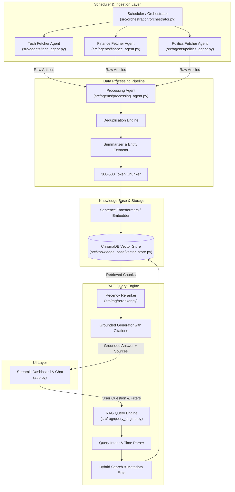

# System Architecture Specification

**Architect**: Principal Solutions Architect  
**Standard Compliance**: Enterprise Engineering Standards  

---

## 1. High-Level Architecture Diagram



---

## 2. Component Blueprint

1. **`src/utils/config.py`**: Environment configuration loader (`.env`), default feed URLs, embedding model settings, chunk parameters.
2. **`src/agents/base_agent.py`**: Base class for news fetchers with RSS parser, HTTP request retry logic, and HTML cleaning.
3. **`src/agents/tech_agent.py`**: Tech fetcher with TechCrunch, BBC Tech, HackerNews feeds and technology keyword filters.
4. **`src/agents/finance_agent.py`**: Finance fetcher with Economic Times, Moneycontrol, RBI press releases, and market/earnings filters.
5. **`src/agents/politics_agent.py`**: Politics fetcher with PIB, Reuters, Indian Express feeds and governance policy filters.
6. **`src/agents/processing_agent.py`**: Normalization, cross-outlet hash/title deduplication, entity extraction (Regex & NLP), article summarization, and token chunking.
7. **`src/orchestration/orchestrator.py`**: Multi-agent lifecycle controller, execution logger, trigger APIs, daily run history.
8. **`src/knowledge_base/embeddings.py`**: SentenceTransformer embedding pipeline wrapper.
9. **`src/knowledge_base/vector_store.py`**: ChromaDB manager with metadata indexing and temporal filtering (`published_date`, `category`).
10. **`src/rag/reranker.py`**: BM25 hybrid scorer combined with recency decay weighting:
    $$\text{Score}(c) = \alpha \cdot \text{VectorSim}(c) + \beta \cdot \text{BM25}(c) + \gamma \cdot e^{-\lambda \cdot \Delta \text{days}}$$
11. **`src/rag/query_engine.py`**: Intent parsing (extracts target category and date bounds), hybrid query execution, recency reranking, grounded response generation with footnotes and fallback.
12. **`app.py`**: Streamlit web interface with tabbed layout:
    - **Tab 1: Interactive Chat**: Real-time Q&A, domain/date pickers, inline citations.
    - **Tab 2: Today's Briefing**: Automated daily summary card by domain.
    - **Tab 3: Orchestration & Logs**: Agent state dashboard, vector DB stats, manual trigger buttons.

---

## 3. Data Schema & Metadata Structure

```json
{
  "chunk_id": "tech_20260928_a1b2c3d4_chunk0",
  "article_id": "tech_20260928_a1b2c3d4",
  "headline": "RBI Announces Policy Rate Decision Amid Market Shifts",
  "content": "The Reserve Bank of India maintained the repo rate at 6.5% during its monetary policy meeting...",
  "source": "Economic Times",
  "url": "https://economictimes.indiatimes.com/news/economy/policy/rbi-rate-decision",
  "category": "Finance",
  "published_date": "2026-09-28",
  "entities": ["RBI", "Repo Rate", "India"],
  "summary": "RBI keeps repo rate unchanged at 6.5%."
}
```
